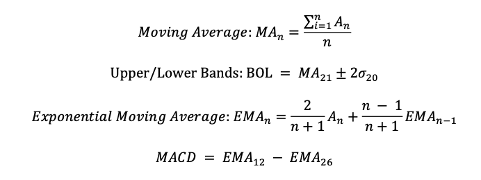
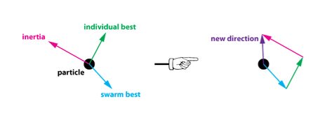
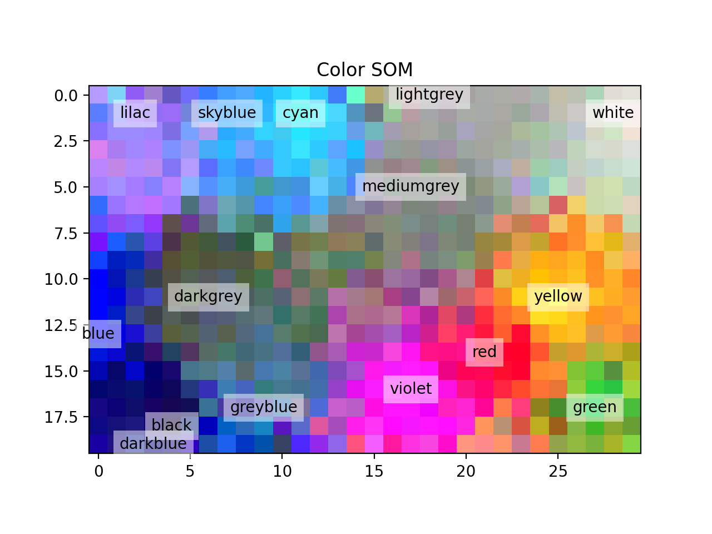
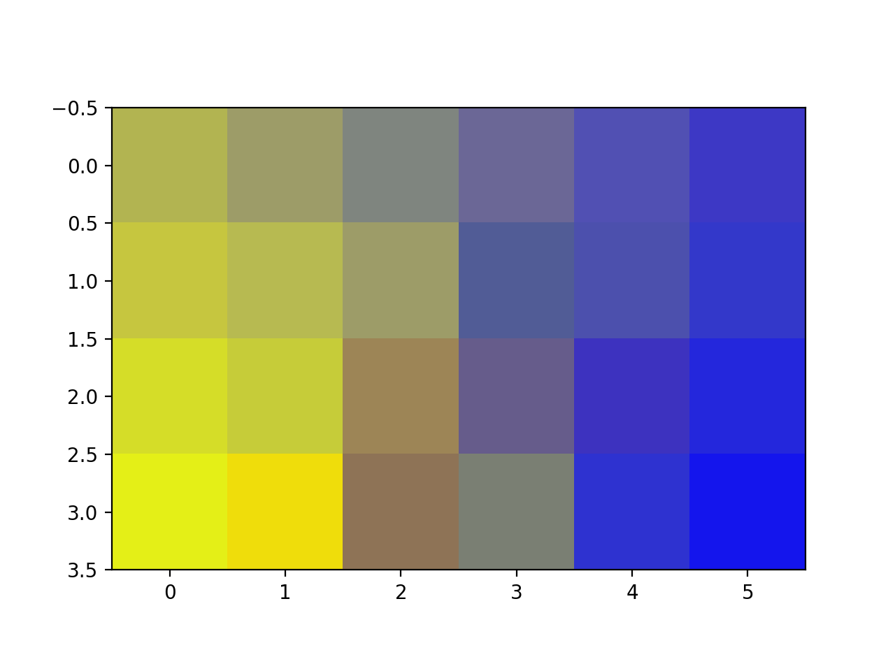
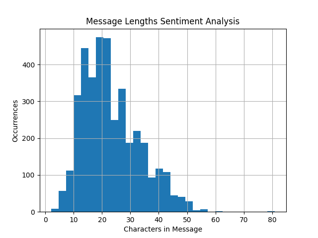
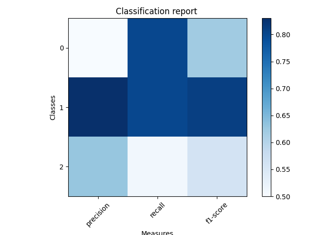
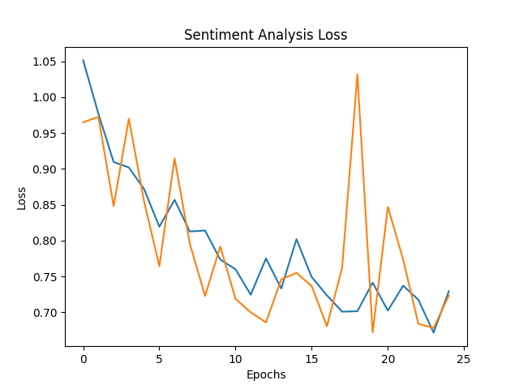
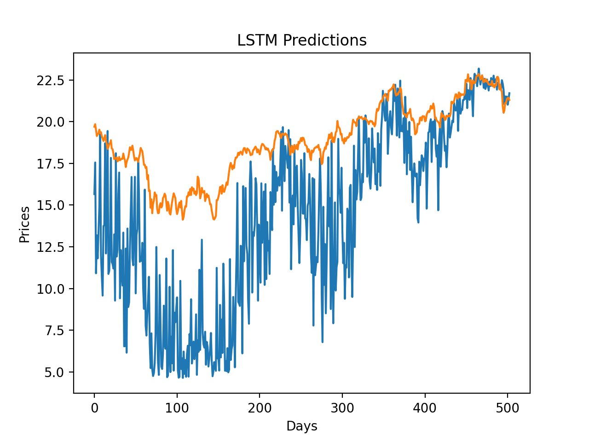
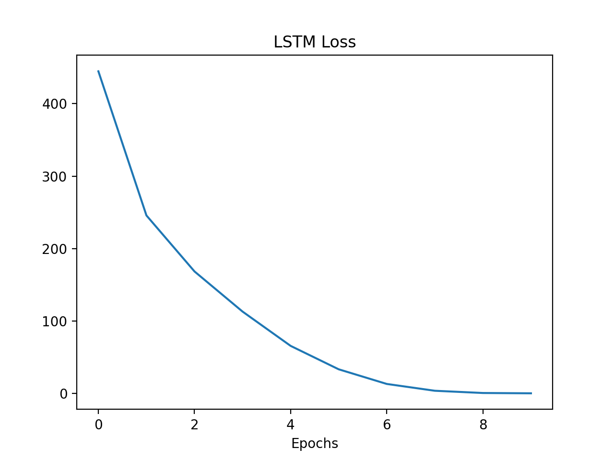

# Stock Forecasting Project

Stock price prediction has long been a focus of both financial professionals and individuals looking to make short and long-term profits. Recently, researchers have uncovered that hybrid machine learning models perform better than models that use individual trend indicators. This paper examines the success of an LSTM-CNN with basic information such as the stock’s close price as well as more complex indicators, including sentiment analysis using BERT and anomaly detection for a currency basket. The anomaly detection incorporates particle swarm optimization as a more efficient alternative to the optimization step in a deep unsupervised neural network. The stock examined in this study was that of GE over the past 10 years. Although the results showed that in the short-term, these strategies will not work, feature boosting alongside long-term simulations using deep reinforcement learning are promising future implementations.

## Technique
The basic indicators were calculated using the following formulas:  

For the anomaly detection on the currency basket, 24 particles were used in a 4x6 grid. A SOM network structure was coded in PyTorch, and the update step for particle weights was replaced by particle swarm optimization. Each particle, which in this case corresponded to the value of each node the in hidden layers of the SOM, was assigned a position and a velocity which gravitated towards local centroids as well as the global optimum after each step. The social constant used was 0.1, whereas the cognitive constant was 0.01 since the technique was ineffective as clustering with too high of a weight on the cognitive step.  

Currency inputs were passed in as tuples containing (EURUSD, USDJPY, EURJPY) for each date of the 10 years, and a 4 by 6 particle grid was used for the SOM. Since updating all the particles at every step would be inefficient as well as ineffective at forming good clusters, every time an input was passed in, the closest particle in the cluster was located, called the best matching unit (BMU). Only points within a certain radius, called the learning radius, were updated. The initial learning radius used was 0.5, which reduced exponentially as the iterations increased. The learning radius did not correspond to the actual distance the new input was away from the BMU, but rather than distance in terms of the radial basis function (RBF), otherwise known as the Gaussian kernel function. This model was first tested on a color dataset, yielding the following promising result:  

The outputs of the SOM were normalized over RGB values and plotted in a similar manner. Since many outliers existed, any particles outside of 2 standard deviations of the mean were omitted.  

Clearly, two clusters existed for the data, which after further analysis, formed a linear relationship. This relationship was expressed as EURUSD in terms of USDJPY and EURJPY and the differences between this and the actual EURUSD value was calculated at each step and called “EURUSD fluctuations.” Many fluctuations were high, indicating that this method did not work as intended, probably focusing in on one region of the trend line between the currencies rather than the trendline as a whole.  

For sentiment analysis, first a BERT model had to be trained. Transfer learning was applied to this problem, where the data was trained on labeled Reddit sentiments and then tested on stock news since a good dataset did not exist for stock news sentiments. Labeled Reddit data was acquired online, whereas testing data was curated by building a “bot” which scraped a Reuters page containing headlines about GE. The BERT model had a linear layer with input size 768 and output size 512, a rectified linear unit (ReLU), a dropout component, a linear layer of input size 512 and output size three, and a softmax unit, yielding a -1, 0, or 1 corresponding to negative, neutral, or positive sentiments, respectively. Messages passed in were tokenized, or put in terms of message units that the model can understand. A max sequence length of 50 was used and the rest of the data was padded to be of this length based on the following calculated message lengths:  

Overall, the precision of positive sentiments was high, and the recall of negative sentiments was very high, as the following classification report shows:  

The sentiment analysis model did show great improvement over the trained iterations, despite the relatively low precision of negative sentiments:  

The model training itself occurred on a LSTM-CNN build using PyTorch. The first 20% of the dataset was used for training and the final 80% was used for testing, where all columns of the dataset were used for the input and the closing price of the subsequent day was the output. Two hidden layers were used in the CNN, each with size 32, and a learning rate of 1e-5 was used. Predictions on the test set had the following results:  

Here, the blue line represents predictions, and the orange line represents actual prices. The loss reduced vastly over the 90,000 epochs of training, which took approximately four hours:  

Finally, to test the overall short-term model performance in a simplistic manner, a basic trading bot was programmed which bought one share if the stock was forecasted to go up the next day and sold all its shares if the stock was forecasted to go down. The trading bot ended with approximately $0.31 less than when it started, indicating that improvements must be made to this model before it can be applied to real world trading.
